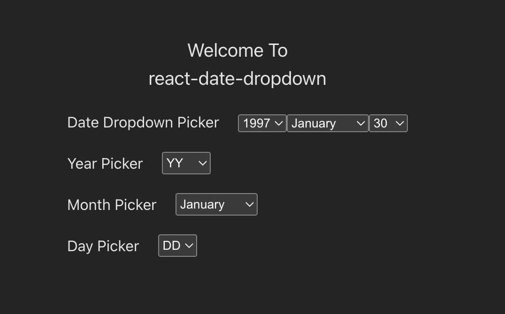

# Welcome to react-date-dropdown 👋

[](https://www.npmjs.com/package/react-date-dropdown)



#### Install

```sh
npm install react-date-dropdown
yarn add react-date-dropdown
```
[Demo Site](https://react-date-dropdown.vercel.app/?path=/docs/introduction--docs)

---

#### DateDropdown
```ts
interface IDateDropdown {
  /** Required. Callback for date change: Format: YYYY-MM-DD */
  onDateChange: (date: string) => void;
  /** Default Date set: Format: YYYY-MM-DD */
  defaultDate?: string;

  /** ClassName */
  className?: {
    container?: string;
    select?: string;
    option?: string;
  };
  /** Styles */
  styles?: {
    container?: React.CSSProperties;
    select?: React.CSSProperties;
    option?: React.CSSProperties;
  };

  /** Placeholder for <select/> input */
  selectPlaceholder?: {
    year: string;
    month: string;
    day: string;
  };
  /** Starting year: Format: YYYY */
  yearStart?: number;
  /** Ending year: Format: YYYY */
  yearEnd?: number;
}

import DateDropdownPicker from 'react-date-dropdown';

<DateDr
```
#### YearPicker
```ts
interface IYearPicker {
  /** Required. Callback for year change: Format: YYYY */
  onYearChange: (year: number) => void;
  /** Default year: Format: YYYY */
  selectedYear?: number;
  /** Placeholder for <select/> input */
  placeholder?: string;
  /** Starting year: Format: YYYY */
  start?: number;
  /** Ending year: Format: YYYY */
  end?: number;
  /** ClassName */
  className?: {
    select?: string;
    option?: string;
  };
  /** Styles */
  styles?: {
    select?: React.CSSProperties;
    option?: React.CSSProperties;
  };
}

import {YearPicker} from 'react-date-dropdown';

<YearPicker
  onYearChange={() => {}}
/>
```

#### MonthPicker
```ts
interface IMonthPicker {
  /** Required. Callback for month change: Format: MM */
  onMonthChange: (month: number) => void;
  /** Default year: Format: MM */
  selectedMonth?: number;
  /** Placeholder for <select/> input */
  placeholder?: string;
  /** ClassName */
  className?: {
    select?: string;
    option?: string;
  };
  /** Styles */
  styles?: {
    select?: React.CSSProperties;
    option?: React.CSSProperties;
  };
}

import {MonthPicker} from 'react-date-dropdown';

<MonthPicker
  onMonthChange={() => {}}
/>
```

#### DayPicker
```ts
interface IDayPicker {
  /** Required. Callback for day change: Format: DD */
  onDayChange: (day: number) => void;
  /** Default year - 1991. Used to calculate number of days */
  year?: number;
  /** Default month - 1. Used to calculate number of days*/
  month?: number;
  /** Default day */
  day?: number;
  /** Placeholder for <select/> input */
  placeholder?: string;
  /** ClassName */
  className?: {
    select?: string;
    option?: string;
  };
  /** Styles */
  styles?: {
    select?: React.CSSProperties;
    option?: React.CSSProperties;
  };
}

import {DayPicker} from 'react-date-dropdown';

<DayPicker
  onDayChange={() => {}}
/>
```
---
#### Show your support

Give a ⭐️ if this project helped you!
